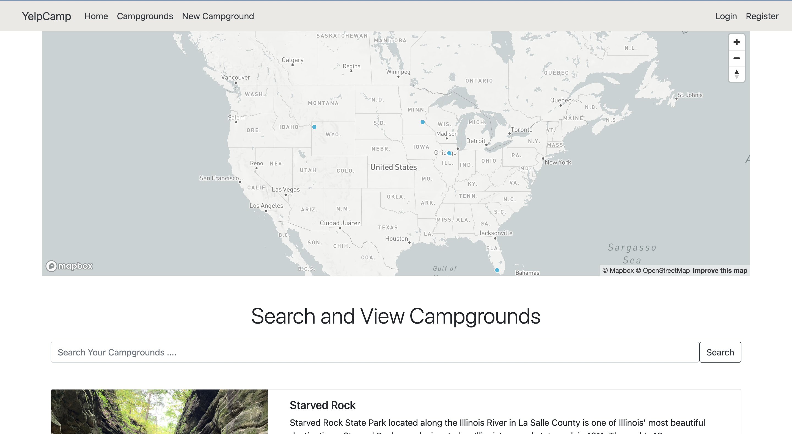

# YelpCamp
<a name="readme-top"></a>

[![Contributors][contributors-shield]][contributors-url]
[![Forks][forks-shield]][forks-url]
[![Stargazers][stars-shield]][stars-url]
[![Issues][issues-shield]][issues-url]
<!-- [![MIT License][license-shield]][license-url] -->
[![LinkedIn][linkedin-shield]][linkedin-url]

<!-- PROJECT LOGO -->
<br />
<div align="center">
  <a href="https://github.com/vcristian1/yelpcamp">
    
  </a>

  <h3 align="center">YelpCamp</h3>

  <p align="center">
    An application for reviewing and visiting campgrounds around the country.
    <br />
    <br />
    <br />
    <a href="https://hidden-tor-07938.herokuapp.com/campgrounds">View Demo</a>
    ·
    <a href="https://github.com/vcristian1/yelpcamp/issues">Report Bug</a>
    ·
    <a href="https://github.com/vcristian1/yelpcamp/issues">Request Feature</a>
  </p>
</div>

<!-- TABLE OF CONTENTS -->
<details>
  <summary>Table of Contents</summary>
  <ol>
    <li>
      <a href="#about-the-project">About The Project</a>
      <ul>
        <li><a href="#built-with">Built With</a></li>
      </ul>
    </li>
    <li>
      <a href="#getting-started">Getting Started</a>
      <ul>
        <li><a href="#prerequisites">Prerequisites</a></li>
        <li><a href="#installation">Installation</a></li>
      </ul>
    </li>
    <li><a href="#contributing">Contributing</a></li>
    <li><a href="#contact">Contact</a></li>
  </ol>
</details>

<!-- ABOUT THE PROJECT -->
## About The Project



<p align="right">(<a href="#readme-top">back to top</a>)</p>

## Built With

This project was built with the following technologies as well as: Mapbox API, Cloudinary API, Flash, EJS template engine, Dotenv, Helmet, JOI validation, Mongoose ODM, Multer, and Passport. 

* 
* 
* 
* [![Bootstrap][Bootstrap.com]][Bootstrap-url]


<p align="right">(<a href="#readme-top">back to top</a>)</p>

<!-- GETTING STARTED -->
## Getting Started

To get started, first clone the repository to your local machine. Then run `npm i` in your terminal to install the dependencies needed to run the project locally. After, run `nodemon app.js` to run the server locally. 

1. Clone the repo
   ```sh
   git clone https://github.com/vcristian1/yelpcamp
   ```
2. Install NPM packages
   ```sh
   npm install
   ```
3. Run the local server `app.js`
   ```js
   nodemon app.js
   ```

<p align="right">(<a href="#readme-top">back to top</a>)</p>

## Issues
See the [open issues](https://github.com/vcristian1/yelpcamp/issues) for a full list of proposed features (and known issues).

<p align="right">(<a href="#readme-top">back to top</a>)</p>

<!-- CONTRIBUTING -->
## Contributing
Contributions are what make the open source community such an amazing place to learn, inspire, and create. Any contributions you make are **greatly appreciated**.

If you have a suggestion that would make this better, please fork the repo and create a pull request. You can also simply open an issue with the tag "enhancement".
Don't forget to give the project a star! Thanks again!

1. Fork the Project
2. Create your Feature Branch (`git checkout -b feature/AmazingFeature`)
3. Commit your Changes (`git commit -m 'Add some AmazingFeature'`)
4. Push to the Branch (`git push origin feature/AmazingFeature`)
5. Open a Pull Request

<p align="right">(<a href="#readme-top">back to top</a>)</p>

<!-- CONTACT -->
## Contact

Cristian Vargas - cristian.v0223@gmail.com

Project Link: [https://github.com/vcristian1/yelpcamp](https://github.com/vcristian1/yelpcamp)

<p align="right">(<a href="#readme-top">back to top</a>)</p>

<!-- MARKDOWN LINKS & IMAGES -->
<!-- https://www.markdownguide.org/basic-syntax/#reference-style-links -->
<!-- https://github.com/REPO-OWNER/REPO-NAME/community_contributors -->
[contributors-shield]: https://img.shields.io/github/contributors/vcristian1/yelpcamp.svg?style=for-the-badge
[contributors-url]: https://github.com/vcristian1/yelpcamp/contributors
[forks-shield]: https://img.shields.io/github/forks/vcristian1/yelpcamp.svg?style=for-the-badge
[forks-url]: https://github.com/vcristian1/yelpcamp/network/members
[stars-shield]: https://img.shields.io/github/stars/vcristian1/yelpcamp.svg?style=for-the-badge
[stars-url]: https://github.com/vcristian1/yelpcamp/stargazers
[issues-shield]: https://img.shields.io/github/issues/vcristian1/yelpcamp.svg?style=for-the-badge
[issues-url]: https://github.com/vcristian1/yelpcamp/issues
[license-shield]: https://img.shields.io/github/license/vcristian1/yelpcamp.svg?style=for-the-badge
[license-url]: https://github.com/vcristian1/yelpcamp/blob/master/LICENSE.txt
[linkedin-shield]: https://img.shields.io/badge/-LinkedIn-black.svg?style=for-the-badge&logo=linkedin&colorB=555
[linkedin-url]: https://www.linkedin.com/in/cristian-vargas-13686a1a3/
[product-screenshot]: images/screenshot.png
[Next.js]: https://img.shields.io/badge/next.js-000000?style=for-the-badge&logo=nextdotjs&logoColor=white
[Next-url]: https://nextjs.org/
[React.js]: https://img.shields.io/badge/React-20232A?style=for-the-badge&logo=react&logoColor=61DAFB
[React-url]: https://reactjs.org/
[Vue.js]: https://img.shields.io/badge/Vue.js-35495E?style=for-the-badge&logo=vuedotjs&logoColor=4FC08D
[Vue-url]: https://vuejs.org/
[Angular.io]: https://img.shields.io/badge/Angular-DD0031?style=for-the-badge&logo=angular&logoColor=white
[Angular-url]: https://angular.io/
[Svelte.dev]: https://img.shields.io/badge/Svelte-4A4A55?style=for-the-badge&logo=svelte&logoColor=FF3E00
[Svelte-url]: https://svelte.dev/
[Laravel.com]: https://img.shields.io/badge/Laravel-FF2D20?style=for-the-badge&logo=laravel&logoColor=white
[Laravel-url]: https://laravel.com
[Bootstrap.com]: https://img.shields.io/badge/Bootstrap-563D7C?style=for-the-badge&logo=bootstrap&logoColor=white
[Bootstrap-url]: https://getbootstrap.com
[JQuery.com]: https://img.shields.io/badge/jQuery-0769AD?style=for-the-badge&logo=jquery&logoColor=white
[JQuery-url]: https://jquery.com 
[Mongodb-url]: https://img.shields.io/badge/MongoDB-%234ea94b.svg?style=for-the-badge&logo=mongodb&logoColor=white